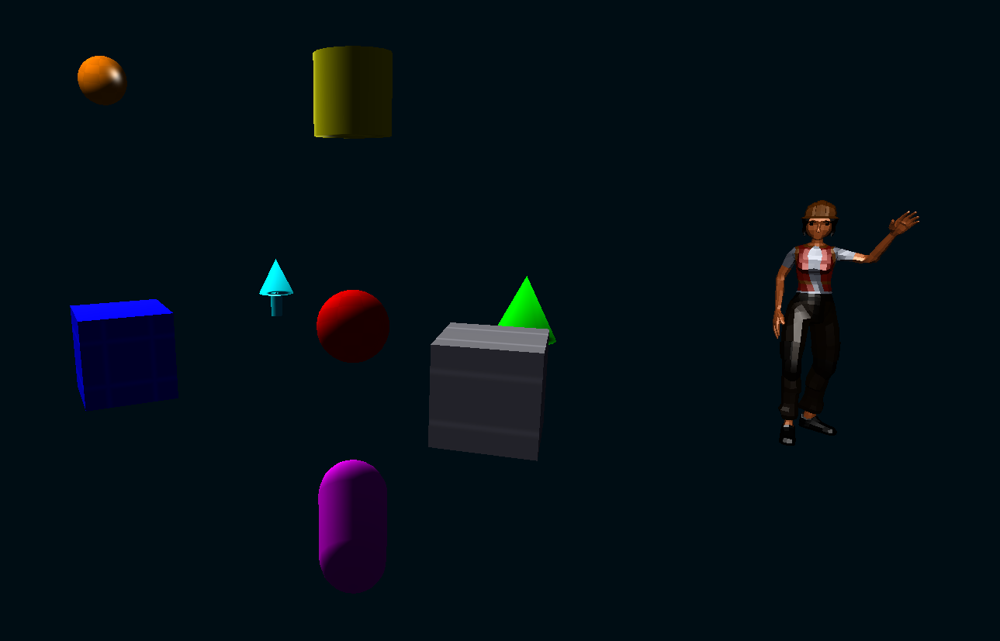

# Light Vulkan Graphics

Light Vulkan Graphics is a lightweight, modern C++ rendering library built on Vulkan. It focuses on clarity, portability, and fast per-frame object updates via instancing and optimized CPU-GPU data paths.



Key capabilities include:
- Flexible shape rendering with instancing (spheres, cubes, cylinders, lines, etc.)
- High-performance per-frame updates (dirty tracking, persistent mapping, double-buffered instance data)
- Camera controls (free-fly, orbit) and LookAt helpers
- Clean CMake build and install with exported package config

SPDX-License-Identifier: LGPL-3.0-or-later

Current platform status:
- Linux is covered in CI with both GCC and Clang builds.
- Windows has a CI build path for the core library.
- macOS may work with system dependencies, but is not currently tested in CI.

## Support
If you would like to support me in putting time into this library please consider becoming a supporter on patreon:
https://patreon.com/Nattydread?utm_medium=unknown&utm_source=join_link&utm_campaign=creatorshare_creator&utm_content=copyLink

## Features
- Optimized instance uploads: dirty-tracked, persistently-mapped, double-buffered instance buffers
- Scene graph API for parent-child transforms over existing primitive and rigged renderables
- Multiple pipelines: flexible shapes, wireframe, unlit
- Camera API: keyboard navigation, orbit controls, `setCameraLookAt`, FOV/planes/sensitivity setters
- Cylinder helpers: connect points and objects conveniently
- CMake package install (`find_package(LightVulkanGraphics)`)

## Dependencies

The build will automatically fetch GLM and, if needed, GLFW. You must have a working Vulkan SDK/runtime, Assimp, and a compiler toolchain.

### Ubuntu (22.04/24.04)
- Vulkan runtime and headers (one of):
  - Option A (recommended): LunarG Vulkan SDK (provides `glslc` too)
  - Option B: System packages:
    - `sudo apt install libvulkan-dev vulkan-tools`
    - Install `glslc` via Vulkan SDK or `shaderc` packages
- Build tools:
  - `sudo apt install build-essential cmake git`
  - Optional: `sudo apt install ninja-build`
- GLFW (optional system): `sudo apt install libglfw3-dev` (project can fetch it if missing)
- GLM (optional system): `sudo apt install libglm-dev` (project can fetch it if missing)
- Assimp (required): `sudo apt install libassimp-dev`

Notes:
- `glslc` is required to compile shaders at build time. If you install the LunarG Vulkan SDK, ensure its `Bin/` (Windows) or `bin/` (Linux) directory is on your PATH before configuring the project.

### Windows (VS 2022)
- Install the latest LunarG Vulkan SDK (includes runtime, headers, `glslc`): `https://vulkan.lunarg.com/`
- Install Visual Studio 2022 with Desktop C++ workload
- Install CMake (optional if using VS CMake integration)
- Git for Windows
- GLFW/GLM: fetched automatically if not found
- Assimp: install separately and point CMake at it with `-DASSIMP_ROOT=...` if it is not on the default search path

Ensure the Vulkan SDK environment variables are set (the installer does this). Verify `glslc` is available in a Developer Command Prompt:
```
glslc --version
```

## Build (Linux/WSL)

```bash
# Clone or download the repository, then run from the project root.

cmake -S . -B build -DCMAKE_BUILD_TYPE=Release
cmake --build build -j

# Optional: install to system (will also install SPIR-V shader payloads)
sudo cmake --install build
```

## Build (Windows, VS 2022)

Option A — CMake CLI:
```bat
REM Run from the repository root.
cmake -S . -B build -G "Visual Studio 17 2022" -A x64
cmake --build build --config Release
```

Option B — Open the folder in Visual Studio and let CMake configure automatically. Select the desired configuration (Release/Debug) and build the `LightVulkanGraphics` target.

macOS notes:
- The project is not currently covered by CI on macOS.
- If GLFW/GLM/Vulkan/Assimp are installed and discoverable, CMake configuration may still work.

## Project Options

Useful CMake options:
- `-DLVG_BUILD_EXAMPLES=OFF` to skip building the bundled examples
- `-DLVG_ENABLE_WARNINGS=ON` to enable recommended compiler warnings on project targets
- `-DLVG_WARNINGS_AS_ERRORS=ON` to turn warnings into errors
- `-DLVG_ENABLE_SANITIZERS=ON` to enable AddressSanitizer and UndefinedBehaviorSanitizer on supported GCC/Clang builds
- `-DASSIMP_USE_FETCHCONTENT=ON` to fetch Assimp instead of using a system/local install

## Install and Use from another project

After `sudo cmake --install build`, you can consume the library with CMake’s `find_package`:

```cmake
cmake_minimum_required(VERSION 3.20)
project(MyApp LANGUAGES CXX)

set(CMAKE_CXX_STANDARD 17)
set(CMAKE_CXX_STANDARD_REQUIRED ON)

find_package(LightVulkanGraphics REQUIRED)

add_executable(my_app main.cpp)
target_link_libraries(my_app PRIVATE LightVulkanGraphics::LightVulkanGraphics)
```

On Linux, runtime discovery of the shared object may require setting `LD_LIBRARY_PATH` if you installed to a non-standard prefix. Alternatively, set an RPATH on your app or install the library system-wide.

## Minimal Usage Example

```cpp
#include "lightVulkanGraphics.h"
#include <glm/glm.hpp>

int main()
{
    lightGraphics::LightVulkanGraphics gfx("Light Vulkan Graphics");

    // Add a red sphere
    gfx.addObject(lightGraphics::ShapeType::SPHERE,
                  glm::vec3(0,0,0), glm::vec3(1.0f),
                  glm::vec4(1,0,0,1));

    // Camera helpers
    gfx.setCameraLookAt({0,2,6}, {0,0,0});

    gfx.finalizeScene();
    gfx.run();
    return 0;
}
```

## Scene Graph Usage

Use `sceneGraph()` when objects need hierarchical transforms. Graph-owned objects are still rendered by the existing flat instance path, but their final model matrices are driven by parent-child world transforms.

```cpp
auto& scene = gfx.sceneGraph();

auto parent = scene.createNode("Parent");
scene.setLocalPosition(parent, {0.0f, 0.0f, 0.0f});

auto child = scene.createObjectNode(lightGraphics::ShapeType::CUBE,
                                    {2.0f, 0.0f, 0.0f},
                                    {1.0f, 1.0f, 1.0f},
                                    {0.2f, 0.6f, 1.0f, 1.0f},
                                    glm::quat(1.0f, 0.0f, 0.0f, 0.0f),
                                    "Child Cube",
                                    1.0f,
                                    parent);

scene.setLocalRotation(parent, glm::angleAxis(glm::radians(45.0f),
                                              glm::vec3(0.0f, 1.0f, 0.0f)));
```

## Light Sources

Scenes start with one default directional light so existing applications keep rendering with visible shading. Applications can replace it with their own lighting setup:

```cpp
gfx.clearLights();
gfx.setAmbientLight({0.08f, 0.08f, 0.10f});

gfx.addDirectionalLight(glm::normalize(glm::vec3(-0.4f, -0.8f, -0.2f)),
                        {1.0f, 1.0f, 1.0f},
                        1.0f,
                        "Sun");

gfx.addPointLight({2.0f, 3.0f, -2.0f},
                  {1.0f, 0.75f, 0.45f},
                  5.0f,
                  8.0f,
                  "Warm Point");

size_t spot = gfx.addSpotLight({-2.0f, 4.0f, -3.0f},
                               glm::normalize(glm::vec3(0.3f, -1.0f, 0.5f)),
                               {0.55f, 0.70f, 1.0f},
                               8.0f,
                               10.0f,
                               glm::radians(15.0f),
                               glm::radians(28.0f),
                               "Cool Spot");

auto shadowedSpot = gfx.getLight(spot);
shadowedSpot.castsShadow = true;
shadowedSpot.shadowStrength = 0.5f;
gfx.updateLight(spot, shadowedSpot);
```

Lights can also be attached to scene graph nodes with `createLightNode()` or `attachLight()`, which makes their position and direction follow parent transforms. The forward renderer currently uploads up to `lightGraphics::MaxForwardLights` lights. Directional and spot lights can cast shadow maps with `LightSource::castsShadow`; point-light shadows are not implemented yet because they require cubemap or six-face rendering.

If you need to override shader discovery before initialization, pass a create-info struct:

```cpp
lightGraphics::LightVulkanGraphicsCreateInfo createInfo;
createInfo.width = 1280;
createInfo.height = 720;
createInfo.shaderPath = "/opt/myapp/share/LightVulkanGraphics/spv";
createInfo.manageGlfwLifecycle = false; // host app manages glfwInit/glfwTerminate
createInfo.enableConsoleOutput = false; // process-wide: suppress console output used by the library/examples
createInfo.enableDebugOutput = true;    // emit debug logs if no log callback is installed

lightGraphics::LightVulkanGraphics gfx("Light Vulkan Graphics", createInfo);
```

Debug logging is disabled by default. If you want diagnostics, either set
`createInfo.enableDebugOutput = true` before construction or call
`setDebugOutput(true)` later. For host applications that already own GLFW,
set `manageGlfwLifecycle = false` before initialization. Console output
routing is enabled by default and is process-wide, not per-instance. To
suppress console output entirely, either set
`createInfo.enableConsoleOutput = false` before construction or call
`lightGraphics::setConsoleOutputEnabled(false)`.

## Included Demo Targets
- `demoVulkanGraphics`: bundled shape demo that ships in this repository and builds with the library
- `simple_fbx_loader_example`: basic FBX inspection example
- `fbx_rigged_example`: rigged-model rendering example

Build the bundled demo after configuring the project:

```bash
cmake --build build --target demoVulkanGraphics -j
./build/demoVulkanGraphics
```

To build all bundled examples together:

```bash
cmake --build build --target LightVulkanGraphicsExamples -j
```

## Bundled Assets
The demo scene includes `assets/Worker.fbx`, which is derived from Quaternius assets and redistributed under CC0 1.0. See `assets/License.txt` for the attribution and license text bundled with the repository.

## Camera Controls (built-in)
- Free-fly: WASD to strafe/forward, Q/E to move down/up (hold Shift to move faster)
- Mouse look: Right-click and drag
- Scroll: zoom (FOV) or dolly in orbit mode
- Programmatic:
  - `setCameraLookAt(eye, target)`
  - `setOrbitEnabled(true/false)`, `setOrbitTarget(...)`, `setOrbitRadius(...)`

## Shader Assets
The build compiles GLSL shaders into SPIR-V under `build/spv/`. Installation places the shader payloads under `${DATAROOTDIR}/LightVulkanGraphics/spv`.

At runtime the library searches, in order:
- an explicit shader directory supplied in `LightVulkanGraphicsCreateInfo`
- `LIGHT_VULKAN_GRAPHICS_SHADER_PATH`
- the build-tree shader directory
- paths relative to the loaded library
- paths relative to the executable and current working directory

This makes installed packages relocatable while still allowing explicit overrides when needed.

## Testing
The project includes CTest smoke tests that:
- build the bundled example targets
- install the library to a temporary prefix
- configure and build an external consumer with `find_package(LightVulkanGraphics)`
- repeat the consumer build against a relocated install tree

The CI workflow runs build-and-test coverage on Linux, a sanitizer pass on Linux/Clang, and a core-library build on Windows.

Run them with:

```bash
ctest --test-dir build --output-on-failure
```

## License
Licensed under the GNU Lesser General Public License v3.0 or later (LGPL-3.0-or-later). See `LICENSE`.

## Contributing
See `CONTRIBUTING.md` for local build/test guidance and `CHANGELOG.md` for release notes.
